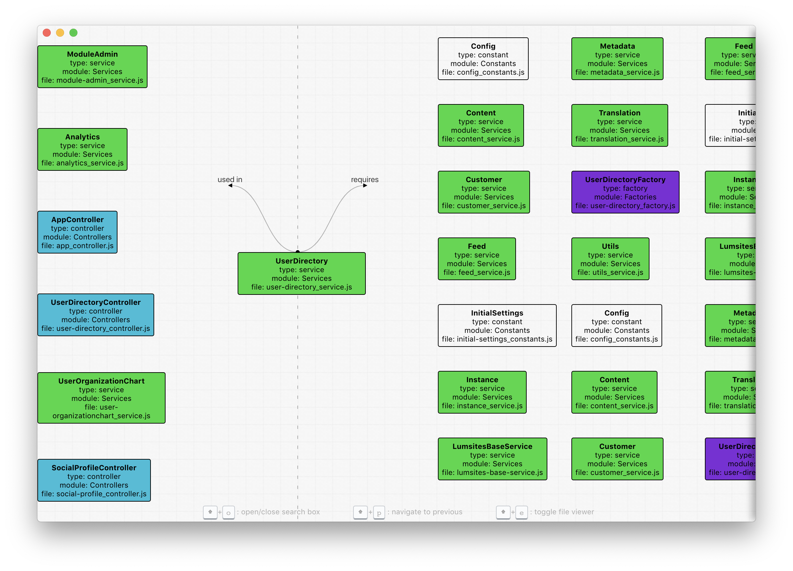

# AngularJS Architecture Explorer
An electron based visual tool used to analyse your AngularJS dependency graph. The tool use the output of [AngularJS Architecture Mapper](https://github.com/GuillaumeNachury/AngularJSArchitectureMapper), so please run the mapper befor using this viewer.

<p align="center">
  
  
  
</p> 

## usage
`yarn` to get this tool dependencies.

Change in `src/app.js`, the server url and port to match yours.
```
const URL_SERVER = "http://127.0.0.1:2601"; // change ip and port here
```

`yarn start` to get the app dev server running.

`yarn electron` to get the UI.
